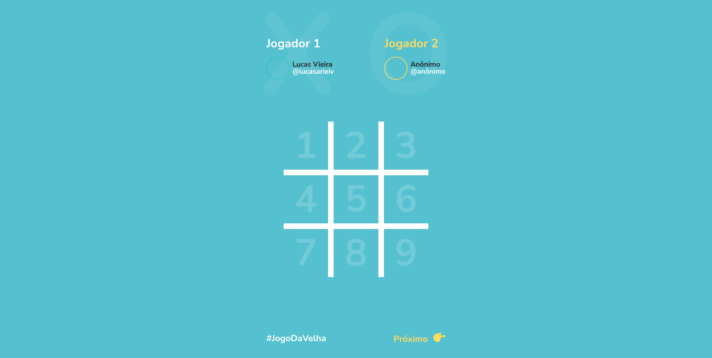

<h1 align="center">#️⃣ Jogo da Velha </h1>

Desenvolvido para fins de estudos.

Link do projeto [JogoDaVelha | GithubPages](lucasarieiv.github.io/JogoDaVelha)

  

Layout Desenvolvidor por  🧑 [Lucas Vieira](github.com/lucasarieiv)

## Tecnologias utilizadas:
- HTML e Css
- Javascript

## Ferramentas UI
- Figma

